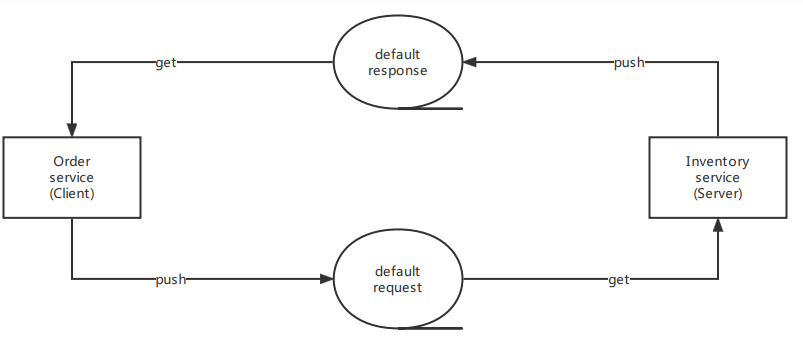
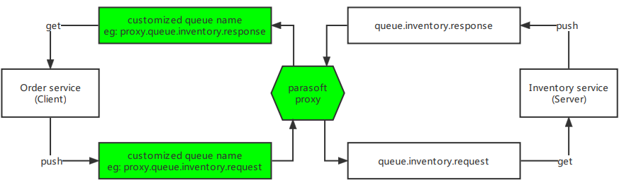
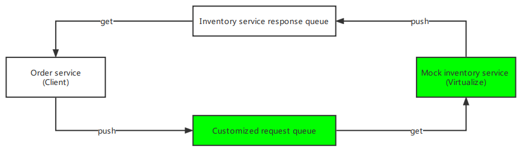
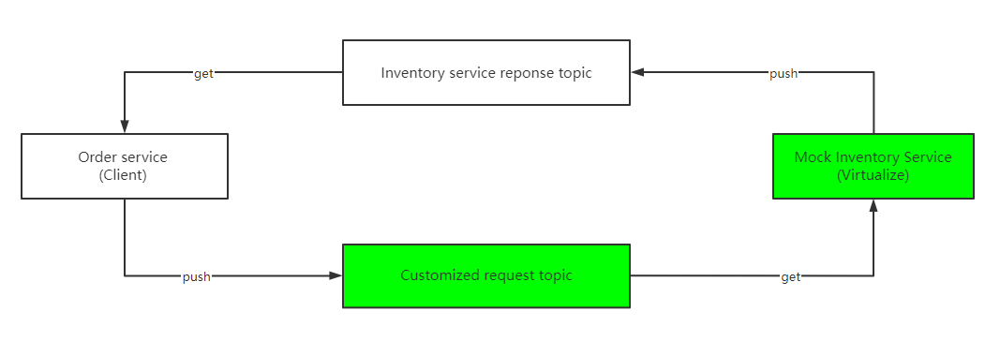

# Parasoft Demo Application
The Parasoft Demo Application is an example Spring Boot project. The application is configurable and customizable, and is used to demonstrate functionality in a variety of Parasoft tools.

The following instruction is for building and running the Parasoft Demo Application locally.<br/> 
There is also a docker image available here: [DockerHub](https://hub.docker.com/r/parasoft/demo-app)
## Getting Started
### Building .war from sources
Once you download the sources, build the project as a .war file using the Gradle wrapper.

In Linux / Cygwin:
```
./gradlew bootWar
```
In Windows:
```
gradlew.bat bootWar
```
The file parasoft-demo-app-1.1.0.war can be found in build/libs after building.
### Running
You can run the application either directly from sources,

In Linux / Cygwin:
```
./gradlew bootRun
```
In Windows:
```
gradlew.bat bootRun
```
Or as a .war file with Java (after building):
```
java -jar build/libs/parasoft-demo-app-1.1.0.war
```
Port can be specified when running .war file:
```
java -jar build/libs/parasoft-demo-app-1.1.0.war --server.port=8888
```
### Importing into your IDE
If you want to import the project into your IDE, be sure to do the following:
1. Import the project as a Gradle project. You may need to synchronize or refresh the project after importing.
2. Install a Lombok plugin for your IDE since the project uses Lombok.
#### Changing server port
When launching the app, you can specify the port to use with a command like the following:
```
./gradlew bootRun -Pport=8888
```
### Configuring application-related properties
1. When running the application from sources:
   
    Change the [application.properties](https://github.com/parasoft/parasoft-demo-app/blob/main/application.properties) file directly or put a customized version of the file to overwrite the properties and put it under config folder before running the application.

    Notes: all configurable properties are available in the example version of application.properties.

2. When running the application as .war file:

    2.1 Create/Overwrite the file in config folder.

    2.2 Overwrite specific properties as command line arguments.

> The **Property** column in configuration tables of this readme refers to the configurable property name in application.properties.

## Using the Demo Application
Once started, you can access the application at [http://localhost:8080](http://localhost:8080).

Login with one of these users:
- Username `purchaser` password `password`
- Username `approver` password `password`

## Connect to embedded HSQLDB server instance
There are four databases (one for global and three for industries) in this Application, which are **global**, **outdoor**, **defense** and **aerospace**.

| Database name | Description                                          |
|---------------|------------------------------------------------------|
| global        | Used to store the user, role and configuration data. |
| outdoor       | Used to store the data about outdoor industry.       |
| defense       | Used to store the data about defense industry.       |
| aerospace     | Used to store the data about aerospace industry.     |

### Connection configuration
This application exposes port 9001 for the user to connect to the HSQLDB database remotely. This port is configurable as **hsqldb.port** in application.properties.

- Global database

| Option   | Value                                      | Property                                          |
|----------|--------------------------------------------|---------------------------------------------------|
| Driver   | `org.hsqldb.jdbcDriver`                    | global.datasource.configuration.driver-class-name |
| URL      | `jdbc:hsqldb:hsql://localhost:9001/global` | global.datasource.configuration.url               |
| Username | `SA`                                       | global.datasource.configuration.username          |
| Password | `pass`                                     | global.datasource.configuration.password          |

- Industry database

| Option   | Value                                               | Property                                                             |
|----------|-----------------------------------------------------|----------------------------------------------------------------------|
| Driver   | `org.hsqldb.jdbcDriver`                             | industry.datasource.configurations.{database name}.driver-class-name |
| URL      | `jdbc:hsqldb:hsql://localhost:9001/{database name}` | industry.datasource.configurations.{database name}.url               |
| Username | `SA`                                                | industry.datasource.configurations.{database name}.username          |
| Password | `pass`                                              | industry.datasource.configurations.{database name}.password          |

## Using Parasoft JMS Proxy and Virtual Asset with message queue
There are two main services for order management in this application, **order service** and **inventory service**. After an order is submitted, order service sends
a request through message queue to check and decrease the inventory. After the operation is done, inventory service sends a response through message queue which includes the information of the operation result.

### Configuration
Two default queues/topics are used to support messaging between **order service** and **inventory service**.
The configuration for queues/topics can be changed or reset to default on **Demo Administration** page.



**Configuration details for embedded ActiveMQ server (default)**

| Option                           | Value                                                    | Property                   |
|----------------------------------|----------------------------------------------------------|----------------------------|
| Provider URL                     | `tcp://localhost:61626`                                  | spring.activemq.broker-url |
| Initial context class            | `org.apache.activemq.jndi.ActiveMQInitialContextFactory` | N.A.                       |
| Connection factory               | `ConnectionFactory`                                      | N.A.                       |
| Username                         | `admin`                                                  | spring.activemq.user       |
| Password                         | `admin`                                                  | spring.activemq.password   |
| Inventory service request queue  | `inventory.request`                                      | N.A.                       |
| Inventory service response queue | `inventory.response`                                     | N.A.                       |

**Configuration details for external Kafka server (default)**

| Option     | Value                 | Property                       |
|------------|-----------------------|--------------------------------|
| Broker URL | `localhost:9092`      | spring.kafka.bootstrap-servers |
| Group ID   | `inventory-operation` | spring.kafka.consumer.group-id |

> For simplicity, messages produced or consumed in this application will be in partition 0 of the topics.
> When the expected behavior is to consume messages from both inside and outside this application(e.g. in SOAtest & Virtualize),
> make sure to use different group ID for the external consumer.

**Configuration details for external RabbitMQ server (default)**

| Option                     | Value                      | Property                 |
|----------------------------|----------------------------|--------------------------|
| Host                       | `localhost`                | spring.rabbitmq.host     |
| Port                       | `5672`                     | spring.rabbitmq.port     |
| Username                   | `guest`                    | spring.rabbitmq.username |
| Password                   | `guest`                    | spring.rabbitmq.password |
| Exchange                   | `inventory.direct`         | N.A.                     |
| Request queue routing key  | `inventory.queue.request`  | N.A.                     |
| Response queue routing key | `inventory.queue.response` | N.A.                     |

> This application supports [Direct Reply-to](https://www.rabbitmq.com/direct-reply-to.html) feature.
> If you want to use RPC (request/reply) pattern in SOAtest, make sure to configure the following fields with the pre-exist pseudo-queue `amq.rabbitmq.reply-to`:
> 1. Set **Reply To** (Transport -> Basic Properties -> Reply To) to `amq.rabbitmq.reply-to`  to publish the response message to it.
> 2. Set **Queue Name** (Transport -> Consume -> Queue Name) to `amq.rabbitmq.reply-to` to consume response message from it.

### Using JMS Proxy
To use the queueing system with JMS proxy, you can change **Destination queue** and **Reply to queue** to customized queue names.
The **Client Connection** in message proxy should be configured with the two customized queues.
The **Server Connection** in message proxy should be configured with the two default queues.



### Using virtual asset with JMS and RabbitMQ
To use the queueing system with virtual asset, you can change **Inventory service request queue** to a customized destination queue name.
The virtual asset deployment should be configured to listen to the customized destination queue and reply to the default response queue.



### Using virtual asset with Kafka
To use Kafka with virtual asset, you can change **Inventory service request topic**
to a customized request topic name. The virtual asset deployment should be configured to listen to the customized request topic and produce messages to the default response topic.



### Using external Kafka server

1. Download, install and start a Kafka server (0.10.0.0 or later) using default settings.
2. Set Kafka broker URL and consumer group ID in **application.properties** file.
3. Start the demo application and change queue type to Kafka in **PARASOFT QUEUE CONFIGURATION** section of **Demo Administration** page.
4. To test connection with Kafka server, either use **Test Connection** button in **Kafka configuration details** link or save changes in **Demo Administration** page.

### Using external RabbitMQ server
1. Download, install Erlang and RabbitMQ, start the RabbitMQ server using default settings.
> The minimum version of RabbitMQ supported in demo application is 2.0.0 (compatible Erlang version is R13B). <br/>
> Reference for compatibility of RabbitMQ and Erlang versions: [RabbitMQ and Erlang/OTP Compatibility Matrix](https://www.rabbitmq.com/which-erlang.html#compatibility-matrix).
2. Set RabbitMQ host, port, username, password in **application.properties** file.
3. Start the demo application and change queue type to RabbitMQ in **PARASOFT QUEUE CONFIGURATION** section of **Demo Administration** page.
4. To test connection with RabbitMQ server, either use **Test Connection** button in **RabbitMQ configuration details** link or save changes in **Demo Administration** page.

## Using gRPC Service
The gRPC service in this application has three methods which support both JSON and Protobuf formats.

### Configuration

| Option             | Value                          | Property         |
|--------------------|--------------------------------|------------------|
| Host               | `localhost`                    | N.A.             |
| Port               | `50051`                        | grpc.server.port |
| Json Service Name  | `grpc.demoApp.JsonService`     | N.A.             |
| Proto Service Name | `grpc.demoApp.ProtobufService` | N.A.             |

### Methods

| Method                | Description                                                                                                            |
|-----------------------|------------------------------------------------------------------------------------------------------------------------|
| getStockByItemId      | Unary call which sends item id and receives stock quantity                                                             |
| getItemsInStock       | Server streaming method which gets information of all items in stock in stream                                         |
| updateItemsInStock    | Bidirectional streaming method which takes information to update item stock and responds with updated item information |
### Using gRPC service with SOAtest

#### JSON service
- getItemsInStock: expects a request body as below.
    ````json5
    {
      "id": 1  // Long
    }
    ````
- getItemsInStock: expects empty request body.
- updateItemsInStock: expects a request body as below.
    ````json5
    {
      "id": 1,    // Long
      "value": 1, // Int
      "operation": "ADD" // Enum type: ADD | REMOVE
    }
    ````
#### Protobuf service
To use gRPC Protobuf service with SOAtest Protobuf clients, you need to add [protobuf-extension.jar](./extension/protobuf-extension.jar) to **Parasoft > Preferences > System Properties** in SOAtest & Virtualize desktop first. Then the message types for request body will be loaded into the Protobuf clients.

#### How to build protobuf-extension.jar
1. Download IoT/Microservices Pack from [Parasoft Marketplace](https://customerportal.parasoft.com/lightningportal/s/marketplace).
2. Download [protoc](https://github.com/protocolbuffers/protobuf/releases) and add "bin" folder path to your system's PATH environment variable.
```
protoc --version // ensure that protoc is installed successfully
```
3. Extract jar file for *com.parasoft.soavirt.messages.protobuf* and run following command with [ProtobufService.proto](./src/main/proto/ProtobufService.proto) under the directory.
```
java -jar com.parasoft.soavirt.messages.protobuf.jar --protoDir path/to/proto/files
```

## Using Parasoft JDBC Proxy
1. Find the **ParasoftJDBCDriver.jar** in **{SOAtest & Virtualize installation directory}/{version}/proxies**.
2. Copy it to **{root directory of parasoft-demo-app}/lib**. (Create the folder if it does not already exist.)
3. Open **SOAtest & Virtualize** desktop, add the **ParasoftJDBCDriver.jar** to **Parasoft > Preferences > JDBC Drivers**.
4. Start Virtualize server in **Virtualize Server** view.
5. Enable the **PARASOFT JDBC PROXY** in **Demo Administration** page, modify started server's **URL**, **Parasoft Virtualize Server path**, and **Parasoft Virtualize group ID** if necessary.
6. Go to **SOAtest & Virtualize** desktop and refresh the Server. If the **Parasoft JDBC Proxy** is enabled successfully, there will be a controller which has the same name as group ID under **JDBC Controllers**.
7. Change the settings of the controller.

## Using SOAtest DB Tool
1. Open **SOAtest & Virtualize** desktop, add the hsqldb driver to **Parasoft > Preferences > JDBC Drivers**.
2. Create a tst file with **DB Tool**.
3. Open the **DB Tool** and open the **Connection** tab. Select **Local** option and fill in **Driver**, **URL**, **Username**, and **Password** for the database.

| Option   | Value                                               |
|----------|-----------------------------------------------------|
| Driver   | `org.hsqldb.jdbcDriver`                             |
| URL      | `jdbc:hsqldb:hsql://localhost:9001/{database name}` |
| Username | `SA`                                                |
| Password | `pass`                                              |

4. Write SQL statement in **SQL Query** tab and run the test. The query results will be shown in **Traffic Object**.