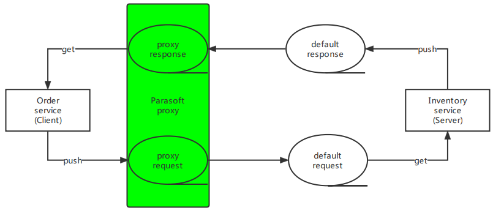

# Parasoft Demo Application
The Parasoft Demo Application is an example Spring Boot project. The application is configurable and customizable, and is used to demonstrate functionality in a variety of Parasoft tools.

## Getting Started
### Building .war from sources
Once you download the sources, build the project as a .war file using the Gradle wrapper.

In Linux / Cygwin:
```
./gradlew bootWar
```
In Windows:
```
gradlew.bat bootWar
```
The file parasoft-demo-app-1.1.0.war can be found in build/libs after building.
### Running
You can run the application either directly from sources,

In Linux / Cygwin:
```
./gradlew bootRun
```
In Windows:
```
gradlew.bat bootRun
```
Or as a .war file with Java (after building):
```
java -jar build/libs/parasoft-demo-app-1.1.0.war
```
### Importing into your IDE
If you want to import the project into your IDE, be sure to do the following:
1. Import the project as a Gradle project. You may need to synchronize or refresh the project after importing.
2. Install a Lombok plugin for your IDE since the project uses Lombok.
#### Changing server port
When launching the app, you can specify the port to use with a command like the following:
```
./gradlew bootRun -Pport=8888
```
## Using the Demo Application
Once started, you can access the application at [http://localhost:8080](http://localhost:8080).

Login with one of these users:
- Username `purchaser` password `password`
- Username `approver` password `password`

## Connect to embedded HSQLDB server instance
There are four databases (one for global and three for industries) in Parasoft Demo Application, which are **global**, **outdoor**, **defense** and **aerospace**.

| Database name | Description                                          |
|---------------|------------------------------------------------------|
| global        | Used to store the user, role and configuration data. |
| outdoor       | Used to store the data about outdoor industry.       |
| defense       | Used to store the data about defense industry.       |
| aerospace     | Used to store the data about aerospace industry.     |

### Connection configuration
Parasoft Demo Application exposes port 9001 for the user to connect to the HSQLDB database remotely.

- Global database

| Option   | Value                                      |
|----------|--------------------------------------------|
| Driver   | `org.hsqldb.jdbcDriver`                    |
| URL      | `jdbc:hsqldb:hsql://localhost:9001/global` |
| Username | `SA`                                       |
| Password | `pass`                                     |

- Industry database

| Option   | Value                                               |
|----------|-----------------------------------------------------|
| Driver   | `org.hsqldb.jdbcDriver`                             |
| URL      | `jdbc:hsqldb:hsql://localhost:9001/{database name}` |
| Username | `SA`                                                |
| Password | `pass`                                              |

## Using Parasoft JMS/MQ Proxy
There are two main services for order management in PDA, **order service** and **inventory service**. After an order is submitted, order service sends
a request through messaging queue to check and decrease the inventory. After the operation is done, inventory service sends a response through messaging queue which includes the information of the operation result.


To use a Parasoft JMS/MQ proxy, you should change the value of input box **Destination queue** to **your customized destination queue name** and the value of input box **Reply to queue** to **your customized reply to queue name** on the PDA Demo Administration page, configure the connection queues with your message proxy in Virtualize.



For virtual asset mode, you only need to change the value of input box **Destination queue** to **your customized destination queue name** on the PDA Demo Administration page.


Configuration details for embedded ActiveMQ server

| Option                | Value                                                    |
|-----------------------|----------------------------------------------------------|
| Provider URL          | `tcp://localhost:61626`                                  |
| Initial context class | `org.apache.activemq.jndi.ActiveMQInitialContextFactory` |
| Connection factory    | `ConnectionFactory`                                      |
| Username              | `admin`                                                  |
| Password              | `admin`                                                  |

## Using Parasoft JDBC Proxy
1. Find the **ParasoftJDBCDriver.jar** in **{SOAtest & Virtualize installation directory}/{version}/proxies**.
2. Copy it to **{root directory of parasoft-demo-app}/lib**. (Create the folder if it does not already exist.)
3. Open **SOAtest & Virtualize** desktop, add the **ParasoftJDBCDriver.jar** to **Parasoft > Preferences > JDBC Drivers**.
4. Start Virtualize server in **Virtualize Server** view.
5. Enable the **PARASOFT JDBC PROXY** in PDA **Demo Admin** page, modify started server's **URL**, **Parasoft Virtualize Server path**, and **Parasoft Virtualize group ID** if necessary.
6. Go to **SOAtest & Virtualize** desktop and refresh the Server. If the **Parasoft JDBC Proxy** is enabled successfully, there will be a controller which has the same name as group ID under **JDBC Controllers**.
7. Change the settings of the controller.

## Using SOAtest DB Tool
1. Open **SOAtest & Virtualize** desktop, add the hsqldb driver to **Parasoft > Preferences > JDBC Drivers**.
2. Create a tst file with **DB Tool**.
3. Open the **DB Tool** and open the **Connection** tab. Select **Local** option and fill in **Driver**, **URL**, **Username**, and **Password** for the database.

| Option   | Value                                               |
|----------|-----------------------------------------------------|
| Driver   | `org.hsqldb.jdbcDriver`                             |
| URL      | `jdbc:hsqldb:hsql://localhost:9001/{database name}` |
| Username | `SA`                                                |
| Password | `pass`                                              |

4. Write SQL statement in **SQL Query** tab and run the test. The query results will be shown in **Traffic Object**.